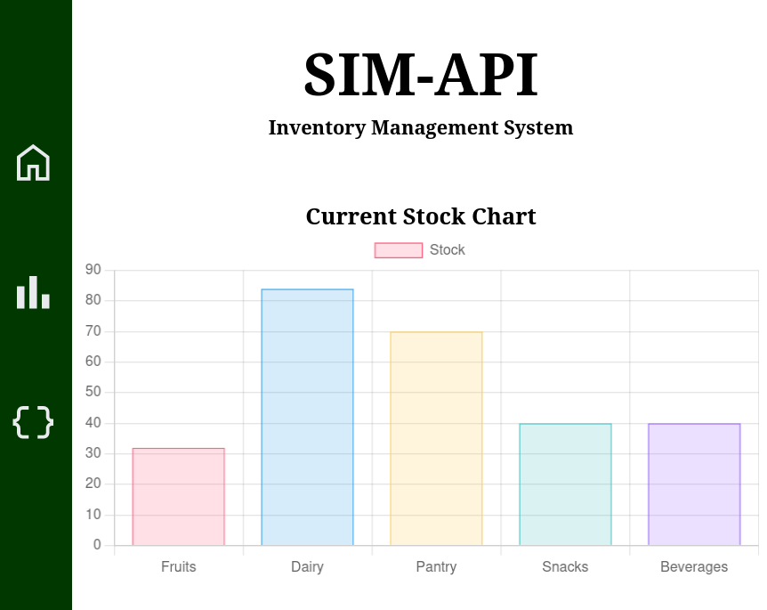

<div align="center">



<h2>Supermarket Inventory Management API</h2>


[](https://github.com/bluesoc/Supermarket-Inventory-Management-API/actions/workflows/django.yml)

[](https://github.com/bluesoc/Supermarket-Inventory-Management-API/actions/workflows/docker-image.yml)


</div>
<br>

**🔥 (Codebase in development)**

This is a backend API designed to manage, update, and delete internal products within an inventory system.

It uses Django Rest Framework, JSON format and caching to handle requests and responses, allowing interopability between systems.

***

### Current API endpoints
| Method   | Route          | Parameter                |
|----------|----------------|--------------------------|
| [GET]    | view/          | [optional int]           |
| [POST]   | create/        | name, category, quantity |
| [DELETE] | delete/<int>   | Int:id of product        |
| [PUT]    | update/<int>   | Int:id [extra fields]    |
| [GET]    | search?q=<str> | str=Item name            |

***

<a href="https://github.com/bluesoc/Supermarket-Inventory-Management-API/projects">IMS Software Engineering Project Page</a>

***

# Installation

To run the application locally, follow the steps below.

Prerequisites:

* Python 3.11 or higher
* Pip (Python package manager)
* Virtualenv (optional, but recommended)

    ### Create a virtual environment (optional):

    ```bash
    python3.11 -m venv venv

    # On Linux or MacOS
    source venv/bin/activate 

    # On Windows:
    venv\Scripts\activate
    ```
    ### 2. Install the dependencies:

    ```bash
    pip install -r requirements.txt
    ```

    ### 3. Run the application

    ```bash
    python /sim_api/manage.py runserver
    ```

    You should be able to access at http://127.0.0.1:8000


# Deploy with Docker 🐋

* Deploy using a Docker container

    ### 1. Create a Docker image:

    ```bash
    docker build -t simapi .
    ```

    ### 3. Run the container:
    ```bash
    docker run -p 5000:5000 simapi
    ```

    The application will be accessible via the IP address of your Docker container on port 5000 (by default). You can access it using the following link:

    http://localhost:5000 or http://\<your-docker-ip\>:5000

***

## Populate Database

The /test folder contains a script to populate the database with sample items for testing purposes.
If you want to run it, use the command bellow

```bash
chmod +x test/api_post.sh

./test/api_post.sh
```

This will send requests to the localhost on port 8000 (the default for Django). This address and port can be configured within the script.

## Usage examples

### 1. GET /view/ or GET /view/\<int:product_id\>

This endpoint returns all registered products, or you can specify a particular product by using its ID (e.g., /view/\<product_id\>).

**Response Example**
```json
[
    {
    model: "api.item",
    pk: 17,
    fields: {
        name:	"Soda",
        category:	"Beverages",
        quantity:	5,
        price:	1.5,
        manufacturer: "FizzFoo",
        stock: true,
        description: "Refreshing soda!"
        }
    }
]
```

### 2. POST /create/

This endpoint registers a new product in the database.

**POST Request Example**

```json
{
    name: "Granola Bars",
    category: "Snacks",
    quantity: 512,
    price: 2,
    manufacturer: "SnackTime",
    stock: true,
    description: "Healthy granola bars"
}
```

### 3. DELETE /delete/\<int:product_id\>

This endpoint deletes a product from the database.

**Response Example**
```json
{"message":"Item deleted successfully"}
```


